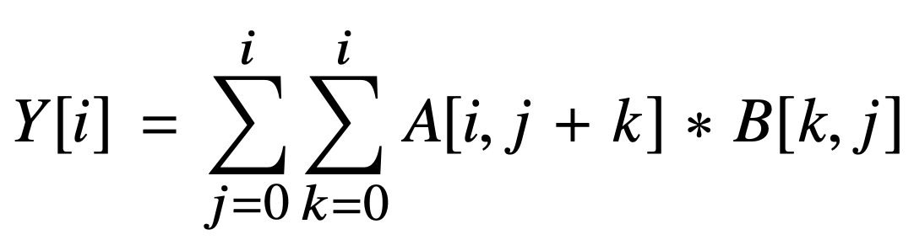

## Can you simplify this reduction?

The python code in `main.py` implements the following reduction:



Given two 2D input arrays A (of size Nx2N) and B (of size NxN), it produces a 1D array Y (of size N) as output, where the i'th element of the output is the sum of the elements in the i'th row of "some" itermediate resultant matrix product using matrices constructed from subsets of values from A and B.
To visualize what this is doing, look at which values of A and B are read across successive iterations of the i-loop.

When i=4 (and N=10) for example, the following values are read from A and B:
```
A:
 · · · · · · · · · · · · · · · · · · · ·
 · · · · · · · · · · · · · · · · · · · ·
 · · · · · · · · · · · · · · · · · · · ·
 · · · · · · · · · · · · · · · · · · · ·
 8 4 4 7 1 7 4 · · · · · · · · · · · · ·
 · · · · · · · · · · · · · · · · · · · ·
 · · · · · · · · · · · · · · · · · · · ·
 · · · · · · · · · · · · · · · · · · · ·
 · · · · · · · · · · · · · · · · · · · ·
 · · · · · · · · · · · · · · · · · · · ·

B:
 8 8 4 3 · · · · · ·
 8 0 5 2 · · · · · ·
 2 9 0 8 · · · · · ·
 5 2 1 4 · · · · · ·
 · · · · · · · · · ·
 · · · · · · · · · ·
 · · · · · · · · · ·
 · · · · · · · · · ·
 · · · · · · · · · ·
 · · · · · · · · · ·
```

When i=5 (and N=10), the following values are read from A and B:
```
A:
 · · · · · · · · · · · · · · · · · · · ·
 · · · · · · · · · · · · · · · · · · · ·
 · · · · · · · · · · · · · · · · · · · ·
 · · · · · · · · · · · · · · · · · · · ·
 · · · · · · · · · · · · · · · · · · · ·
 8 0 6 9 1 2 0 7 1 · · · · · · · · · · ·
 · · · · · · · · · · · · · · · · · · · ·
 · · · · · · · · · · · · · · · · · · · ·
 · · · · · · · · · · · · · · · · · · · ·
 · · · · · · · · · · · · · · · · · · · ·

B:
 8 8 4 3 7 · · · · ·
 8 0 5 2 6 · · · · ·
 2 9 0 8 2 · · · · ·
 5 2 1 4 2 · · · · ·
 3 9 2 5 8 · · · · ·
 · · · · · · · · · ·
 · · · · · · · · · ·
 · · · · · · · · · ·
 · · · · · · · · · ·
 · · · · · · · · · ·
```

Notice that across iterations on i, distinct elements from A are read but many (a quadratic number) of the same elements from B are read.

The `kernel` function takes cubic time as written, O(N^3).
```
$ python main.py 250
N = 250
-> OPS = 5177125
```

## challenge

Can you rewrite the `kernel` function so that its asymptotic complexity is lower?
